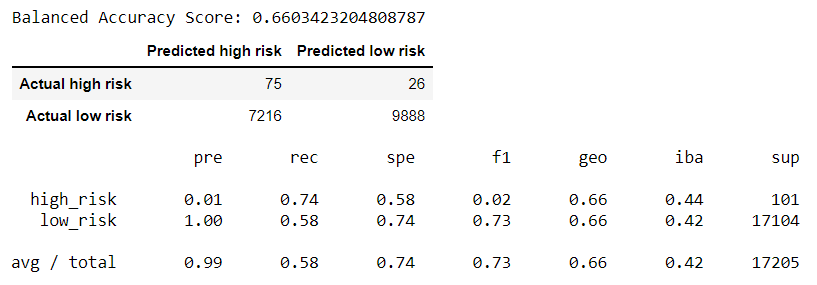
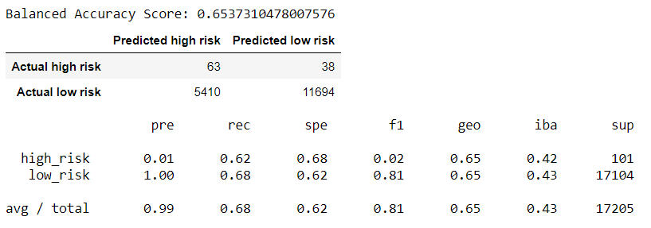
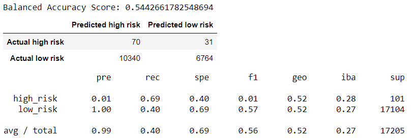
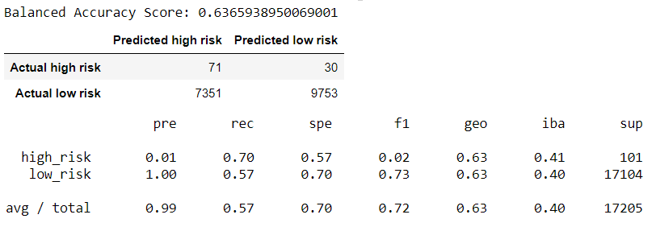
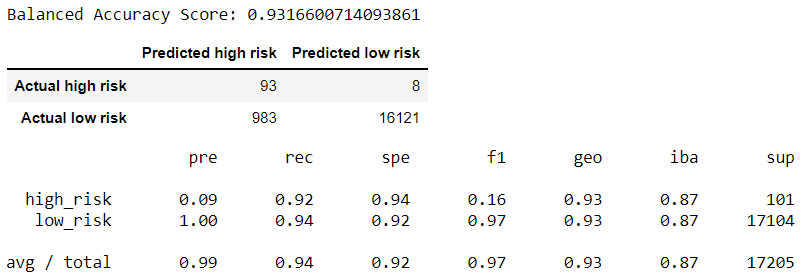

# Credit Risk Analysis

## Overview 
Using the credit card credit dataset from LendingClub, a peer-to-peer lending services company, apply several machine learn models to predict credit risk. Then, we will evaluate the performance of these models and make a written recommendation on whether they should be used to predict credit risk. 

## Result

- RandomOverSampler model

- SMOTE model

- ClusterCentroids model

- SMOTEENN model

- BalancedRandomForestClassifier model

- EasyEnsembleClassifier model

## Summary
